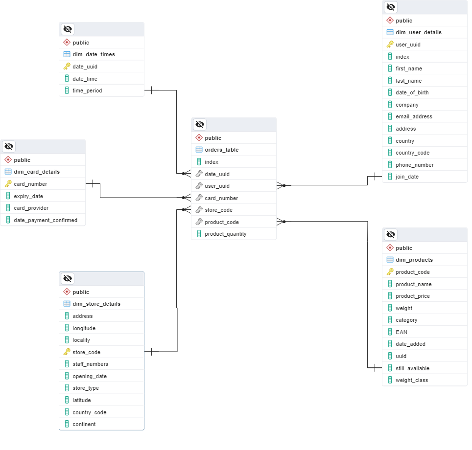

# Multinational retail data centralization

##  Description

The main goal of the project, as the name suggests, was to centralize sales data from multiple locations into one database.
It was meant to challenge the ability to use data handling, data cleaning and database management and show an understanding of 
the subject in practice. Since the retail data was being hosted in multiple locations (AWS RDS & S3, API) and in multiple formats (csv, json, pdf), 
this required different approaches and the use of different python dependencies.
Overall it has been an interesting experience, which makes one realize what issues might arise when handling data and what knowledge gaps are still to be filled
in that respect. The most significant benefit of completing the project was a direct exposure to the challenges of data cleaning, which also took the most time to complete.
It is critical to get this part right, and so the amount of thought investment has reflected it. I have re-written the code on many occasions in order to optimise and fix issues that 
have been missed initially. The inclusion of docstrings and comments has made it easy to track the parts of code that still needed work.


### Milestone 1: Set up the environment

The first milestone involved setting up the git hub repository and has been a straightforward task.

### Milestone 2: Extract and clean the data from the data sources

This was a major part of the project aiming at the implementation of core classes and methods.

The code has been segregated into four python scripts:

**database_utils.py**

Contains the class DatabaseConnector with all methods related to interacting with databases.
These include: reading credentials, creating an engine (use of sqlalchemy), listing all tables in a database and uploading data.
Note that files containing database credentials have been included in the .gitignore file for security reasons.

**data_cleaning.py**

Contains the class DataCleaning witl all methods that clean the extracted data.
Each task in this milestone required to process a different set of data and so each has its own method in the class.
Data tables contained information about: users, credit cards, stores, products, times of purchase.

The products data contained a column with weights, which was more complex to clean and received a dedicated method.
The complication was that the entries contained different units of weight for different products (grams, kilograms and mililitres, ounces). 
Some entries contained multiplications of smaller weights, in the format of: weight x quantity.
Additionally, there were incorrect entries and null values as in the case of other data tables.
The solution I have chosen to unify the weight data was to filter the data to all entries that contain "x", which was only present in the multiplications.
The unit of weight (in this case "g") has been removed from all filtered entries and the "x" replaced with and asterisk. See code below:
```
df.loc[df['weight'].str.contains('x'), 'weight'] = df.loc[df['weight'].str.contains('x'), 'weight'].replace(to_replace='g', value='', regex=True)
df.loc[df['weight'].str.contains('x'), 'weight'] = df.loc[df['weight'].str.contains('x'), 'weight'].replace(to_replace='x', value='*', regex=True)
```
This has enabled me to use the pandas.eval() and a lambda function to calculate the weights and convert to kilograms, as required. See code below:
```
df.loc[df['weight'].str.contains('\*'), 'weight'] = df.loc[df['weight'].str.contains('\*'), 'weight'].apply(lambda x : pd.eval(x)/1000)
```
In the above line, pd.eval(x) takes in "x" as a string and calculates the contents. This means that entries containing: weight * quantity get calculated, correcting the entry.
Similar logic has been applied to less complex entries that just required a change of unit.

Observations for the processed datasets:
- string entries of 'NULL'
- incorrect entries of an alphanumerical format with 10 characters, for example: XYZ123XU8E
- dates in mixed formats
- mixed data types in columns

**data_extraction.py**

Contains the class DataExtractor.
Methods included in the class focus on extracting data from various sources.
Makes use of the DataConnector class to execute database queries.

**main.py**

Main project file, which utilizes the DataCleaning, DatabaseConnector and DataExtractor classes.
Data processing followed the below sequence:
- Download data from source.
- Consolidate and clean data.
- Upload to local database.

### Milestone 3: Create the database schema

The star-based schema considers one of the tables as the centre of all information. The main table contains foreign keys that reference the primary keys in the other tables prefixed with "dim" and referred to as dimension tables.



Tables with clean data already exist in the local database following actions listed in Milestone 2.
The following task involved converting data types for certain columns to SQL recognised types, for instance:
- TEXT columns converted to UUID, FLOAT, VARCHAR, DATE or BOOL
- BIGINT to SMALLINT

The project assumed most columns were TEXT, however, during the data cleaning process I have converted the data types to ones that were found more suitable using Pandas, which made the task simpler going forward.
For some columns that needed convertion to VARCHAR there was a requirement to implement a constraint on the maximum length of allowed entries.

To show the maximum character length in a given column in SQL the following clause was used:

    SELECT MAX(LENGTH( column_name ))
        FROM table_name;

To convert column to VARCHAR and add max length constraint:

    ALTER TABLE table_name
	    ALTER COLUMN column_name TYPE VARCHAR( max_number_of_chars );

The PRIMARY and FOREIGN KEY constraints were added as follows:
    	
    ALTER TABLE table_name	
        ADD PRIMARY KEY (column_name),
        ADD FOREIGN KEY (column_name_in_current_table) REFERENCES column_name_in_ref_table (column_name_in_current_table);

Note that when adding the FOREIGN KEY constraint the entries in the current column need to match entries in the referenced column.

## Installation instructions
### Cloning the repository from GitHub
- Install Git for your OS

    [Download Git](https://git-scm.com/downloads)
- Open terminal 
- Change the current working directory to the location where you want the cloned directory
- Type in the following command and press enter:

```
git clone https://github.com/JarekWnuk/multinational-retail-data-centralisation.git
```
- The repository will be cloned to the current working directory
### Dependencies
The MRDC project uses the following libraries (name==version):
- boto3==1.34.14
- numpy==1.23.5
- pandas==2.0.3
- PyYAML==6.0.1
- Requests==2.31.0
- SQLAlchemy==2.0.19
- tabula_py==2.8.2
- python-dotenv==1.0.1  

These can be installed using the included "requirements.txt" file with PIP:

    pip install -r requirements.txt
    
Please ensure that your working directory is in the project folder when executing the command above.

### AWS setup
An Amazon account and CLI setup is needed to access AWS resources programmatically.

See the official Amazon docs for setup:

[Setting up AWS CLI](https://docs.aws.amazon.com/cli/latest/userguide/getting-started-quickstart.html)

## Running the program

### Prerequisites
- YAML file(s) with database credentials, example below:
```
RDS_HOST: your_host_address
RDS_PASSWORD: your_password
RDS_USER: your_user
RDS_DATABASE: your_database_name
RDS_PORT: your_port
```
- endpoint URLs to get files with data to process (provided in main.py)
- env file with the API key (pass to the process_stores_data function), example below:
```
x-api-key="your_key_here"
```

### Executing code

All the code required to run the program is available in the main.py file:
```
python main.py
```

Please note that database credentials need to be passed to the DatabaseConnector class in order to communicate with the database.

## Business related SQL queries

Executing SQL queries on the finished database allows to answer relevant questions about the business:

**Which month in each year produced the highest sales?**

QUERY:
```
SELECT 
	SUM(ROUND(product_price::numeric,2) * product_quantity) AS total_sales,
	EXTRACT(YEAR FROM date_time) AS "Year",
	EXTRACT(MONTH FROM date_time) AS "Month"
FROM
	orders_table AS ot
INNER JOIN dim_products AS p
	ON ot.product_code = p.product_code
INNER JOIN dim_date_times AS dt
	ON ot.date_uuid = dt.date_uuid
GROUP BY
	EXTRACT(MONTH FROM date_time),
	EXTRACT(YEAR FROM date_time)
ORDER BY
	total_sales DESC
LIMIT
	10;
```

OUTPUT:
```
total_sales     	year    month

27936.77	    1994	  3
27356.14	    2019	  1
27091.67	    2009	  8
26679.98	    1997	  11
26310.97	    2018	  12
26277.72	    2019	  8
26236.67	    2017	  9
25798.12	    2010	  5
25648.29	    1996	  8
25614.54	    2000	  1
```

**What percentage of sales comes from each type of store?**

QUERY:
```
WITH my_cte AS (
	SELECT SUM(ROUND(product_price::numeric,2) * product_quantity) AS total_sales_all
	FROM dim_products AS p
	INNER JOIN orders_table AS ot
		ON p.product_code = ot.product_code)

SELECT store_type, SUM(ROUND(product_price::numeric,2) * product_quantity) AS total_sales,
	ROUND(SUM(ROUND(product_price::numeric,2) * product_quantity) /
	(SELECT SUM(ROUND(product_price::numeric,2) * product_quantity)
	 FROM
		dim_store_details AS sd
	INNER JOIN orders_table AS ot
		ON sd.store_code = ot.store_code
	INNER JOIN dim_products AS p
		ON ot.product_code = p.product_code ) * 100,2) AS percentage
FROM
	dim_store_details AS sd
INNER JOIN orders_table AS ot
	ON sd.store_code = ot.store_code
INNER JOIN dim_products AS p
	ON ot.product_code = p.product_code
GROUP BY
	store_type
ORDER BY
	total_sales DESC;
```

OUTPUT:
```
store_type      total_sales     percentage

"Local"	        3440896.52	    44.56
"Web Portal"	1726547.05	    22.36
"Super Store"	1224293.65	    15.85
"Mall Kiosk"	698791.61	    9.05
"Outlet"	631804.81	    8.18
```

**How quickly is the company making sales?**

QUERY:
```
WITH cte AS(
SELECT
	date_time,
	EXTRACT(YEAR FROM date_time) AS "year",
	date_time AS "current_date_time",
	LEAD(date_time) OVER(ORDER BY date_time) AS next_time
FROM 
	dim_date_times
),
cte2 AS(
SELECT
	date_time,
	year,
	next_time - "current_date_time" AS time_between_sales
FROM
	cte
)
SELECT
	year,
	CONCAT('hours: ', CAST(EXTRACT( HOUR FROM AVG(time_between_sales)) AS TEXT),
		  ' minutes: ', CAST(EXTRACT( MINUTE FROM AVG(time_between_sales)) AS TEXT),
		   ' seconds: ',CAST(EXTRACT( SECOND FROM AVG(time_between_sales)) AS TEXT)) AS actual_time_taken
FROM 
	cte2
GROUP BY
	year
ORDER BY
	AVG(time_between_sales) DESC
LIMIT 5;
```

OUTPUT:
```
year     actual_time_taken

2013	"hours: 2 minutes: 17 seconds: 15.655442"
1993	"hours: 2 minutes: 15 seconds: 40.129515"
2002	"hours: 2 minutes: 13 seconds: 49.478228"
2008	"hours: 2 minutes: 13 seconds: 3.532442"
2022	"hours: 2 minutes: 13 seconds: 2.003698"
```